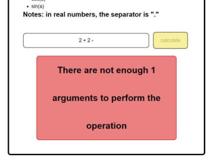

Expression-calculator is simple Spring MVC application, which calculates math expressions. 

The application translates mathematical expressions in infix notation to postfix using the sorting station algorithm. 

The algorithm is described below. 

Not all tokens have been processed yet: 

1. Read the token. 
1. If the token is a number, then add it to the output queue. 
1. If the token is a function, then put it on the stack. 
1. If the token is a separator of function arguments (for example, a comma): 
- While the token is at the top of the stack, there is no opening bracket: 
- move the operator from the stack to the output queue; 
- if the stack ended before the opening parenthesis token was encountered, then the function argument separator (comma) was omitted in the expression, or the opening parenthesis was omitted. 
5. If the token is an op1 operator: 
- as long as there is an op2 operator at the top of the stack, whose priority is higher or equal to the priority of op1, and if the priorities are equal, op1 is left-associative: 

\- shift op2 from the stack to the output queue; 

1. Put op1 on the stack. 
6. If the token is an opening bracket, then put it on the stack. 
6. If the token is a closing bracket: 
   1. while the token is at the top of the stack, there is no opening bracket 
- move the operator from the stack to the output queue; 
- if the stack ended before the opening parenthesis token was encountered, then the parenthesis is omitted in the expression; 
  1. remove the opening bracket from the stack, but do not add it to the output queue; 
  1. if the token at the top of the stack is a function, move it to the output queue. 
8. If there are no more tokens left at the input: 
   1. As long as there are tokens operators in the stack: 
- if the token operator at the top of the stack is an opening parenthesis, then the parenthesis is omitted in the expression; 
- move the operator from the stack to the output queue. 

The end of the algorithm. 

It is important to make sure that each token is output in the final expression only once, and operators, functions and brackets are added and removed from the stack also once. The linear complexity of this algorithm is O(n). 

The user interface is described below: 

When the user enters your expression and clicks the button: 

if the expression contains errors: 

